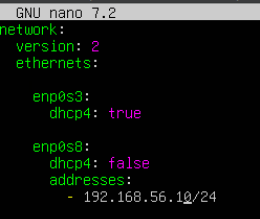
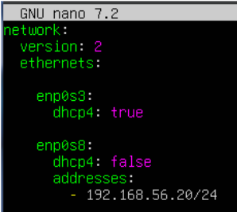
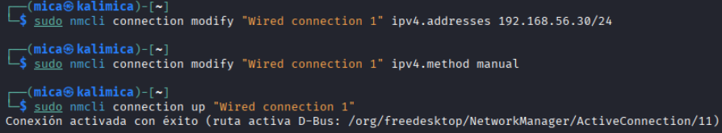
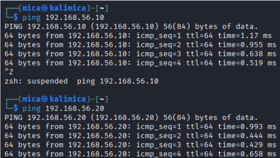
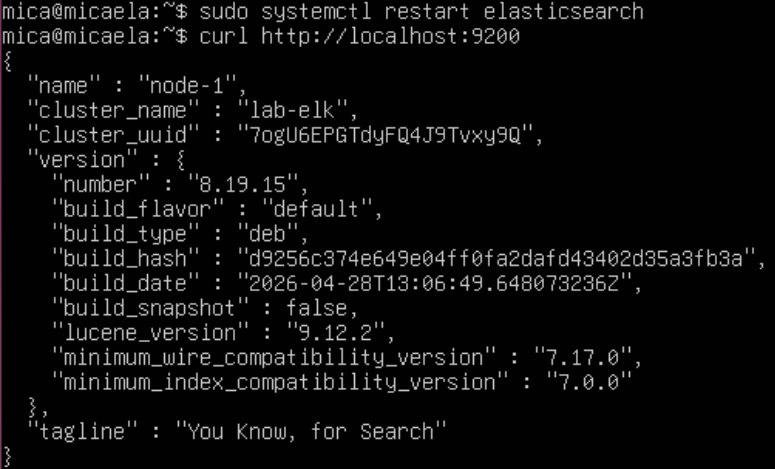
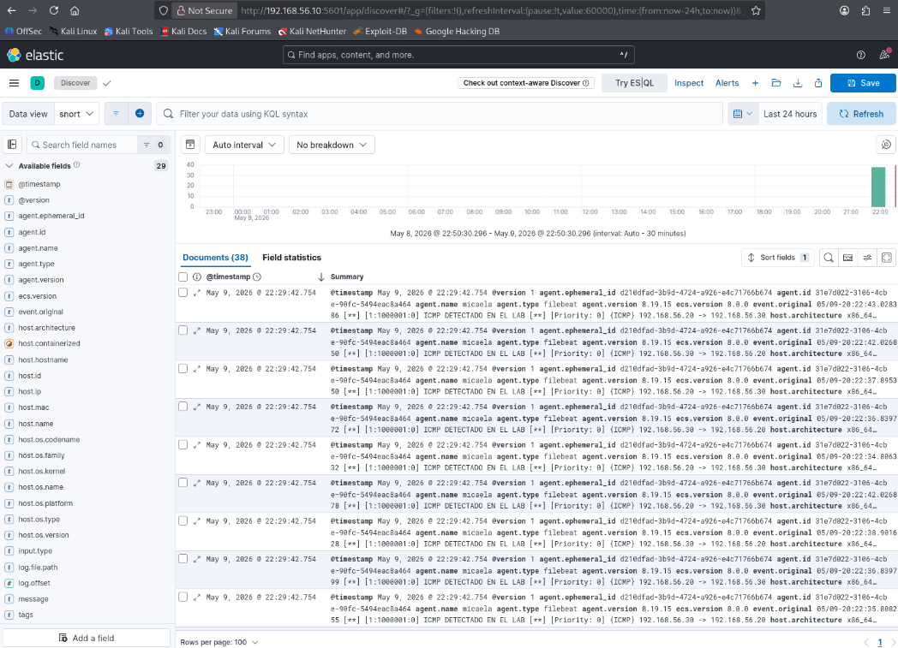
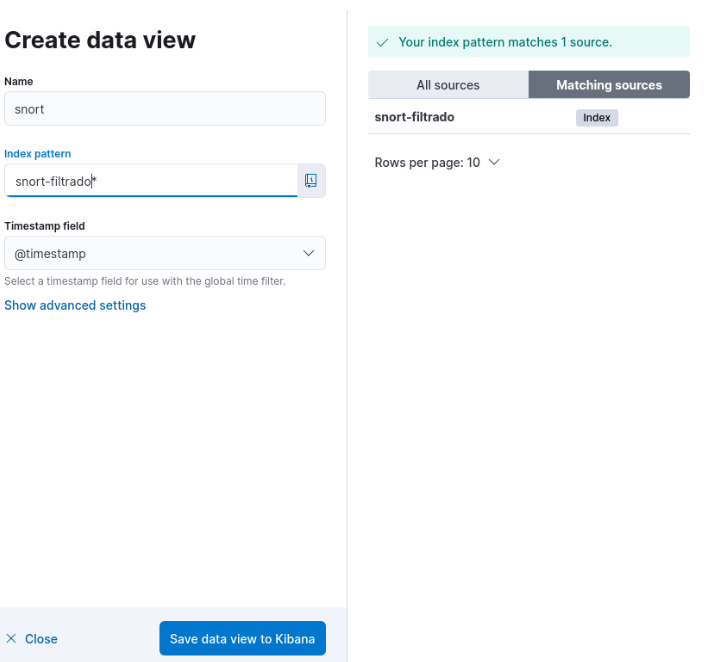
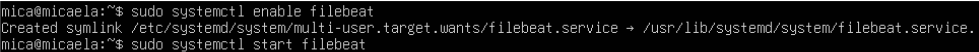
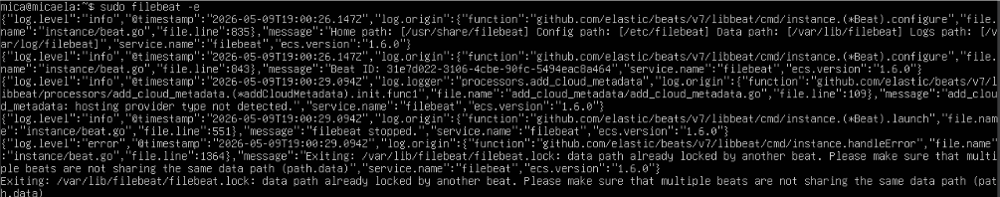
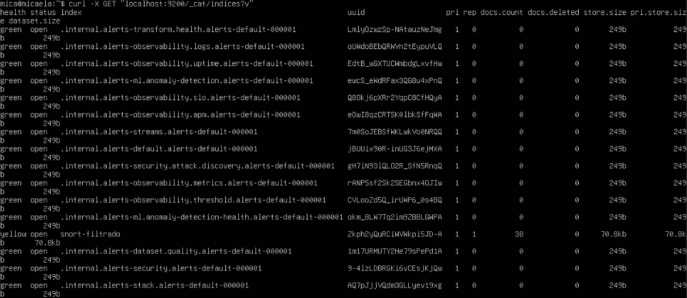

# Full Documentation - SIEM Monitoring Lab with Elastic Stack and Snort

# Introducción

En este proyecto se desarrolló un laboratorio SIEM orientado a monitorización de seguridad y análisis de eventos utilizando Elastic Stack junto con Snort como sistema IDS.

El objetivo principal fue simular un pequeño entorno SOC donde diferentes máquinas generan tráfico y eventos que posteriormente son detectados, procesados y visualizados desde una plataforma centralizada. Para ello se trabajó con tecnologías como Elasticsearch, Kibana, Logstash, Filebeat y Snort dentro de un entorno virtualizado sobre Linux.

Durante el desarrollo del laboratorio se configuró un flujo completo de eventos de seguridad, permitiendo observar cómo una alerta generada por el IDS puede ser recogida, procesada e indexada dentro de un SIEM moderno para posteriormente ser analizada desde Kibana.

Además de la parte relacionada con monitorización y gestión de logs, el proyecto también permitió reforzar conocimientos relacionados con redes, administración Linux, análisis de eventos, configuración de servicios y conceptos básicos de Blue Team.

---

# Objetivos del laboratorio

Los principales objetivos del proyecto fueron los siguientes:

- Desplegar un entorno SIEM funcional utilizando Elastic Stack
- Configurar un IDS basado en Snort para detectar tráfico sospechoso
- Centralizar logs de seguridad dentro de Elasticsearch
- Procesar eventos utilizando Logstash
- Visualizar alertas y eventos desde Kibana
- Comprender el flujo completo de eventos dentro de una arquitectura defensiva
- Simular un entorno básico orientado a SOC y monitorización de seguridad

---

# Arquitectura del entorno

El laboratorio se compone de tres máquinas virtuales conectadas mediante una red interna virtualizada:

| Máquina | Función | Dirección IP |
|---|---|---|
| SIEM-ELK | Elasticsearch + Kibana + Logstash | 192.168.56.10 |
| IDS-SNORT | Snort + Filebeat | 192.168.56.20 |
| KALI | Generación de tráfico y pruebas | 192.168.56.30 |

Cada máquina cumple una función específica dentro del flujo de eventos del laboratorio.

La máquina IDS es la encargada de monitorizar tráfico y generar alertas mediante Snort. Posteriormente Filebeat recoge los logs generados y los envía hacia Logstash, donde son procesados antes de almacenarse dentro de Elasticsearch. Finalmente Kibana permite visualizar y analizar toda la información desde una interfaz gráfica.

---

# Flujo de funcionamiento del laboratorio

El funcionamiento general del laboratorio sigue el siguiente flujo:

1. La máquina Kali genera tráfico de prueba dentro de la red
2. Snort detecta eventos según las reglas configuradas
3. Las alertas se almacenan en logs locales
4. Filebeat monitoriza continuamente dichos logs
5. Filebeat envía eventos hacia Logstash
6. Logstash procesa y clasifica la información recibida
7. Elasticsearch indexa los eventos procesados
8. Kibana permite consultar y visualizar las alertas generadas

Gracias a esta arquitectura fue posible simular de forma práctica un entorno de monitorización defensiva similar al utilizado en infraestructuras SOC reales.

---

# Implementación

## Configuración de red

Se configuró una red interna virtualizada para permitir la comunicación entre las diferentes máquinas del laboratorio.

### Capturas

- Configuración IP de SIEM ELK



- Configuración IP de IDS SNORT



- Configuración IP de KALI



- Conectividad entre máquinas



---

## Instalación de Elasticsearch

Se desplegó Elasticsearch como motor principal de almacenamiento e indexación de eventos de seguridad.

### Capturas 

- Servicio funcionando

  

- curl localhost:9200



---

## Instalación de Kibana

Kibana se configuró para conectarse a Elasticsearch y facilitar la visualización gráfica y análisis de eventos generados dentro del laboratorio.

### Capturas 

- Página principal de Kibana


- Discover

  

- Data Views
  


---

## Configuración de Filebeat

Filebeat se instaló en la máquina IDS para monitorizar continuamente los logs generados por Snort y enviarlos hacia Logstash para su procesamiento.

### Capturas 

- filebeat.yml


- Servicio activo



- Logs enviados correctamente




---

## Configuración de Logstash

Logstash se utilizó para procesar eventos y añadir campos personalizados según el tipo de tráfico detectado, permitiendo clasificar y organizar mejor la información almacenada.

### Capturas 

- Pipeline de Logstash
  


---

## Configuración de Snort

Snort se configuró como sistema IDS para detectar diferentes tipos de tráfico y generar alertas relacionadas con ICMP, SSH y otros eventos definidos mediante reglas personalizadas.

### Capturas 

  
- Logs del IDS
  
    


---

# Resultados obtenidos

El laboratorio permitió centralizar correctamente eventos de seguridad dentro de Elastic Stack y visualizar alertas desde Kibana mediante índices personalizados en Elasticsearch.

Además, se consiguió procesar y clasificar tráfico mediante filtros de Logstash, facilitando la detección de eventos relacionados con conexiones ICMP, accesos SSH y actividad sospechosa generada desde la máquina de pruebas.

La integración entre Snort, Filebeat, Logstash y Elasticsearch permitió simular un flujo realista de monitorización de seguridad orientado a entornos SOC y Blue Team.

---

# Conocimientos aplicados

- Monitorización de seguridad
- SIEM
- Blue Team
- IDS
- Gestión de logs
- Elastic Stack
- Redes
- Linux
- Análisis de eventos
- Seguridad defensiva

---

# Estructura del repositorio

```bash
siem-monitoring-lab-elastic-snort/
│
├── README.md
├── docs/
├── images/
├── configs/
└── notes/
```

---

# Autor

Proyecto desarrollado como laboratorio práctico de ciberseguridad orientado a tecnologías SIEM, monitorización defensiva, análisis de eventos y gestión centralizada de logs en entornos Linux.
