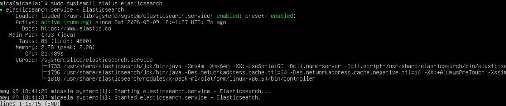
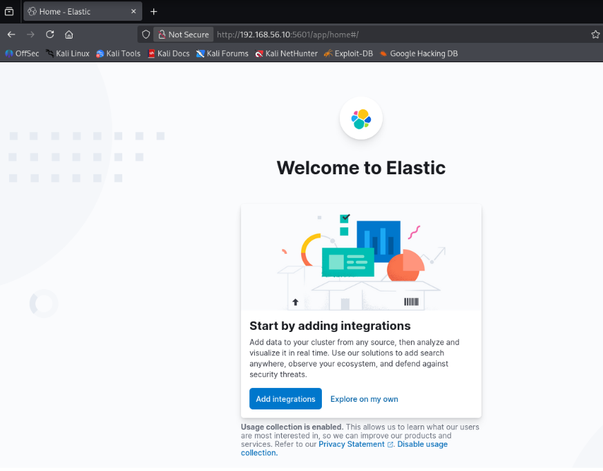
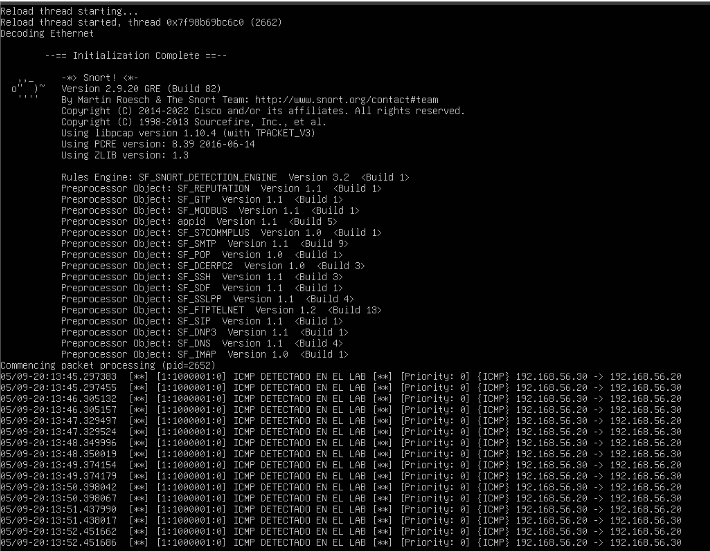
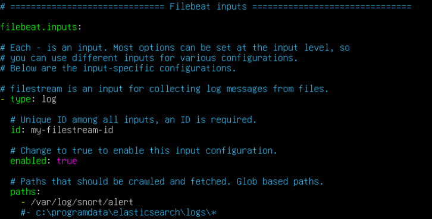
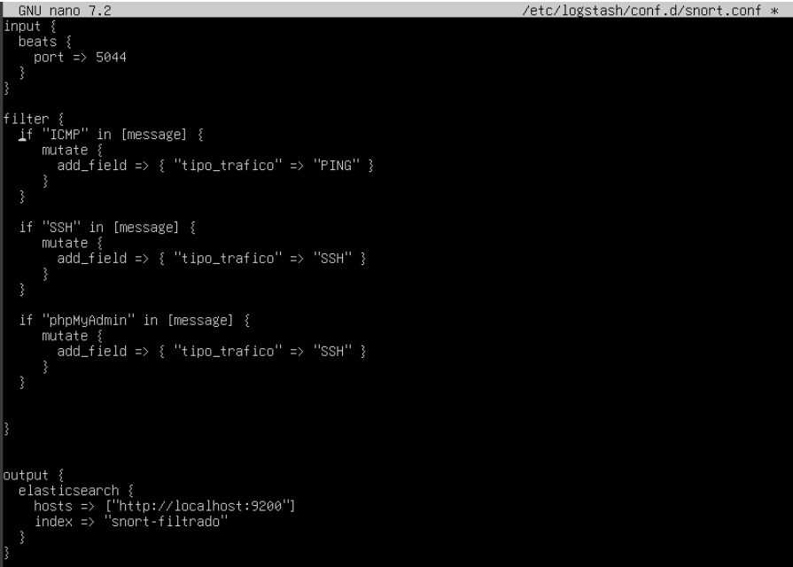

# Documentación completa - Laboratorio SIEM con Elastic Stack y Snort IDS

# Introducción

En este proyecto se desarrolló un laboratorio SIEM orientado a monitorización defensiva y análisis de eventos de seguridad utilizando Elastic Stack junto con Snort como sistema IDS dentro de un entorno virtualizado sobre Linux.

El objetivo principal del laboratorio fue simular una pequeña infraestructura SOC donde diferentes máquinas generan tráfico de red y eventos que posteriormente son detectados, procesados y visualizados desde una plataforma centralizada. Para ello se trabajó con tecnologías ampliamente utilizadas en entornos SIEM reales como Elasticsearch, Kibana, Logstash, Filebeat y Snort.

Además de aprender el funcionamiento básico de cada herramienta, una de las partes más importantes del laboratorio fue comprender cómo fluye un evento de seguridad desde el momento en el que se genera en una máquina monitorizada hasta que termina siendo visualizado desde Kibana. Esto permitió entender de forma mucho más práctica cómo funcionan los sistemas de monitorización modernos utilizados en Blue Team y centros SOC.

La infraestructura se desplegó utilizando máquinas virtuales conectadas mediante una red interna configurada desde VirtualBox, permitiendo realizar todas las pruebas dentro de un entorno completamente aislado y controlado.

---

> [!NOTE]
> Todas las pruebas realizadas durante el laboratorio se ejecutaron únicamente sobre sistemas virtualizados preparados específicamente para prácticas de monitorización y análisis defensivo.

---

# Objetivos del laboratorio

Los principales objetivos del proyecto fueron:

- Desplegar un entorno SIEM funcional utilizando Elastic Stack
- Configurar Snort como sistema IDS
- Detectar tráfico sospechoso dentro de la red
- Centralizar logs de seguridad mediante Filebeat y Logstash
- Procesar y clasificar eventos utilizando filtros personalizados
- Visualizar alertas y eventos desde Kibana
- Comprender el flujo completo de eventos dentro de una arquitectura SIEM
- Reforzar conocimientos relacionados con Linux, redes y monitorización defensiva

---

# Arquitectura del laboratorio

El laboratorio estuvo formado por varias máquinas virtuales conectadas mediante una red interna virtualizada.

| Máquina | Función | Dirección IP |
|---|---|---|
| SIEM-ELK | Elasticsearch + Kibana + Logstash | 192.168.56.10 |
| IDS-SNORT | Snort + Filebeat | 192.168.56.20 |
| KALI | Generación de tráfico y pruebas | 192.168.56.30 |

Cada máquina cumplía una función específica dentro del flujo de eventos.

La máquina IDS era la encargada de monitorizar tráfico y generar alertas mediante Snort. Posteriormente Filebeat recogía los logs generados y los enviaba hacia Logstash, donde eran procesados antes de almacenarse dentro de Elasticsearch. Finalmente Kibana permitía consultar y visualizar toda la información desde una interfaz gráfica centralizada.


---

# 1. Preparación del entorno

## 1.1 Configuración inicial de las máquinas virtuales

Antes de comenzar con la instalación de Elastic Stack fue necesario preparar el entorno virtualizado creando las máquinas necesarias para el laboratorio. Todas ellas se configuraron dentro de una red interna desde VirtualBox para mantener el tráfico completamente aislado del exterior.

La máquina principal del SIEM se encargó de alojar Elasticsearch, Kibana y Logstash, mientras que una segunda máquina actuó como IDS utilizando Snort junto con Filebeat para enviar los logs hacia el servidor SIEM. Finalmente, una máquina Kali Linux se utilizó para generar tráfico y realizar pruebas controladas.

El uso de IPs estáticas facilitó la comunicación entre máquinas y evitó problemas relacionados con cambios automáticos de direccionamiento.

---

## 1.2 Actualización del sistema

Lo primero realizado fue actualizar completamente el sistema operativo para evitar posibles problemas de compatibilidad entre paquetes y asegurar que todas las herramientas utilizadas funcionasen sobre versiones recientes y estables.

Se ejecutaron los siguientes comandos:

```bash
sudo apt update
sudo apt upgrade -y
```

`apt update` actualiza la lista de repositorios disponibles mientras que `apt upgrade -y` instala automáticamente las últimas versiones de los paquetes ya presentes en el sistema.

Aunque puede parecer un paso simple, resulta importante realizarlo antes de desplegar servicios como Elasticsearch o Kibana, ya que muchos errores posteriores suelen estar relacionados con dependencias desactualizadas o incompatibilidades entre versiones.

---

## 1.3 Instalación de dependencias

Para desplegar Elastic Stack correctamente fue necesario instalar Java y varias herramientas auxiliares relacionadas con gestión de paquetes y descargas HTTPS.

La instalación se realizó mediante:

```bash
sudo apt install apt-transport-https openjdk-17-jdk wget curl -y
```

Cada paquete cumple una función específica dentro del entorno:

- `openjdk-17-jdk` proporciona el entorno Java requerido por Elasticsearch
- `wget` y `curl` permiten descargar archivos y repositorios externos
- `apt-transport-https` habilita repositorios seguros mediante HTTPS

Una vez finalizada la instalación se comprobó que Java estuviese funcionando correctamente:

```bash
java -version
```

---

> [!IMPORTANT]
> Elasticsearch depende completamente de Java para funcionar. Si Java no está instalado correctamente, el servicio no podrá iniciarse.

---

# 2. Instalación y configuración de Elasticsearch

## 2.1 Adición del repositorio oficial

Como Elasticsearch no se encuentra incluido dentro de los repositorios estándar de Ubuntu, fue necesario añadir el repositorio oficial de Elastic.

Primero se importó la clave GPG oficial:

```bash
curl -fsSL https://artifacts.elastic.co/GPG-KEY-elasticsearch | sudo gpg --dearmor -o /usr/share/keyrings/elastic.gpg
```

Este paso permite verificar la autenticidad de los paquetes descargados y evitar posibles manipulaciones externas.

Posteriormente se añadió el repositorio:

```bash
echo "deb [signed-by=/usr/share/keyrings/elastic.gpg] https://artifacts.elastic.co/packages/8.x/apt stable main" | sudo tee /etc/apt/sources.list.d/elastic-8.x.list
```

Finalmente se actualizó nuevamente la lista de paquetes:

```bash
sudo apt update
```

---

## 2.2 Instalación del servicio

Una vez añadido el repositorio, Elasticsearch se instaló mediante:

```bash
sudo apt install elasticsearch -y
```

Después de finalizar la instalación se habilitó el servicio para que arrancase automáticamente junto al sistema:

```bash
sudo systemctl enable elasticsearch
sudo systemctl start elasticsearch
```

Para comprobar que el servicio estaba funcionando correctamente se verificó su estado:

```bash
sudo systemctl status elasticsearch
```

También se comprobó la conectividad local:

```bash
curl localhost:9200
```

Si Elasticsearch está funcionando correctamente devuelve información relacionada con el nodo y la versión instalada.



---

# 3. Instalación y configuración de Kibana

## 3.1 Instalación del servicio

Kibana se instaló utilizando el mismo repositorio oficial de Elastic:

```bash
sudo apt install kibana -y
```

Posteriormente se habilitó e inició el servicio:

```bash
sudo systemctl enable kibana
sudo systemctl start kibana
```

---

## 3.2 Configuración de Kibana

El archivo principal de configuración se encuentra en:

```bash
/etc/kibana/kibana.yml
```

Se modificaron algunos parámetros básicos para permitir el acceso desde la red interna del laboratorio:

```yaml
server.host: "0.0.0.0"
elasticsearch.hosts: ["http://localhost:9200"]
```

La opción `server.host` permite que Kibana escuche conexiones desde otras máquinas de la red y no únicamente desde localhost.

Después de modificar la configuración se reinició el servicio:

```bash
sudo systemctl restart kibana
```

Finalmente se accedió desde el navegador:

```txt
http://192.168.56.10:5601
```

Una vez dentro de Kibana se configuraron Data Views y se comenzó a visualizar la información indexada desde Elasticsearch.



---

# 4. Instalación y configuración de Snort IDS

## 4.1 Instalación del IDS

Snort se instaló en la máquina encargada de monitorizar tráfico dentro del laboratorio:

```bash
sudo apt install snort -y
```

Durante la instalación se indicó la red utilizada dentro del entorno virtualizado para que Snort pudiera monitorizar correctamente el tráfico generado.

---

## 4.2 Configuración de reglas

Las reglas locales se almacenaron dentro de:

```bash
/etc/snort/rules/local.rules
```

Se añadieron reglas simples para detectar tráfico ICMP y conexiones SSH:

```conf
alert icmp any any -> any any (msg:"ICMP Packet Detected"; sid:1000001; rev:1;)

alert tcp any any -> any 22 (msg:"SSH Connection Detected"; sid:1000002; rev:1;)
```

Estas reglas permitieron generar alertas fácilmente durante las pruebas desde Kali Linux.

Aunque son reglas básicas, ayudaron a comprender cómo funciona un IDS y cómo las alertas pueden ser utilizadas posteriormente dentro de un SIEM.

---

## 4.3 Ejecución de Snort

Para ejecutar Snort en modo IDS se utilizó:

```bash
sudo snort -A console -q -c /etc/snort/snort.conf -i enp0s3
```

- `-A console` muestra alertas directamente en consola
- `-q` reduce información innecesaria
- `-c` indica el archivo de configuración
- `-i` especifica la interfaz monitorizada

Antes de ejecutar Snort fue necesario comprobar correctamente el nombre de la interfaz mediante:

```bash
ip a
```

Esto evitó errores relacionados con interfaces incorrectas o tráfico no monitorizado.



---

# 5. Instalación y configuración de Filebeat

## 5.1 Función de Filebeat dentro del laboratorio

Filebeat se utilizó como agente encargado de recoger los logs generados por Snort y enviarlos hacia Logstash para su posterior procesamiento.

La función de Filebeat dentro del laboratorio fue especialmente importante porque permitió automatizar el envío de eventos desde la máquina IDS hacia el servidor SIEM.

---

## 5.2 Instalación de Filebeat

La instalación se realizó mediante:

```bash
sudo apt install filebeat -y
```

Posteriormente se configuró el archivo principal:

```bash
/etc/filebeat/filebeat.yml
```

---

## 5.3 Configuración de entrada y salida

Se configuró Filebeat para monitorizar continuamente el archivo de alertas generado por Snort:

```yaml
filebeat.inputs:
  - type: log
    enabled: true
    paths:
      - /var/log/snort/alert
```

Posteriormente se configuró la salida hacia Logstash:

```yaml
output.logstash:
  hosts: ["192.168.56.10:5044"]
```

Esto permitió enviar automáticamente todos los eventos detectados hacia el pipeline de Logstash.

Finalmente se reinició el servicio:

```bash
sudo systemctl restart filebeat
sudo systemctl enable filebeat
```



---

# 6. Configuración de Logstash

## 6.1 Creación del pipeline

Logstash se utilizó para procesar eventos enviados desde Filebeat y añadir información personalizada según el tipo de tráfico detectado.

El pipeline se configuró dentro de:

```bash
/etc/logstash/conf.d/snort.conf
```

Configuración utilizada:

```conf
input {
  beats {
    port => 5044
  }
}

filter {

  if "ICMP" in [message] {
    mutate {
      add_field => { "traffic_type" => "PING" }
    }
  }

  if "SSH" in [message] {
    mutate {
      add_field => { "traffic_type" => "SSH" }
    }
  }

}

output {
  elasticsearch {
    hosts => ["http://localhost:9200"]
    index => "snort-events"
  }
}
```

El objetivo de este filtro fue clasificar distintos tipos de tráfico para facilitar posteriormente las búsquedas y visualizaciones desde Kibana.


---

## 6.2 Inicio del servicio

```bash
sudo systemctl enable logstash
sudo systemctl start logstash
```

Comprobación:

```bash
sudo systemctl status logstash
```


---

# 7. Pruebas realizadas y generación de eventos

Una vez desplegado todo el entorno se realizaron diferentes pruebas desde Kali Linux para generar tráfico y comprobar el funcionamiento completo del flujo de eventos.

Las pruebas realizadas incluyeron:

- Ping ICMP
- Conexiones SSH
- Escaneo básico de red
- Generación de tráfico HTTP

El objetivo principal fue comprobar que:

1. Snort detectaba correctamente el tráfico
2. Filebeat recogía los logs generados
3. Logstash procesaba los eventos
4. Elasticsearch indexaba la información
5. Kibana mostraba correctamente las alertas

Gracias a estas pruebas fue posible validar el funcionamiento completo del entorno SIEM.

---

# 8. Resultados obtenidos

El laboratorio permitió desplegar un entorno SIEM funcional capaz de centralizar, procesar y visualizar eventos de seguridad generados por Snort.

La integración entre Filebeat, Logstash, Elasticsearch y Kibana permitió comprender de forma práctica cómo funciona el flujo completo de eventos dentro de un entorno SOC orientado a monitorización defensiva.

Además, el proyecto ayudó a reforzar conocimientos relacionados con:

- Linux
- Redes
- SIEM
- IDS
- Elastic Stack
- Gestión de logs
- Blue Team
- Monitorización de seguridad
- Procesamiento de eventos
- Análisis defensivo

---

# 9. Conclusiones

Este laboratorio permitió trabajar de forma práctica tecnologías muy utilizadas dentro de entornos SOC y Blue Team, entendiendo no solo cómo instalar cada herramienta, sino también cómo se relacionan entre ellas dentro de una arquitectura SIEM real.

La parte más importante del proyecto fue comprender el flujo completo de un evento de seguridad, desde la generación del tráfico hasta su visualización final dentro de Kibana, ya que esto ayudó a entender mucho mejor cómo funcionan las plataformas de monitorización utilizadas actualmente en infraestructuras defensivas.
